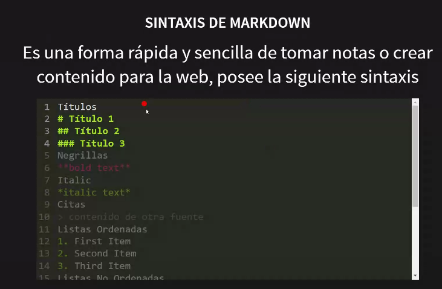

# Sesión 02

Títulos
# Título 1
## Título 2
### Título 3
Negrillas
**bold text**
Italic
*italic text*
Citas
> contenido de otra fuente

Listas Ordenadas 
1. First Item
2. Second Item 
3. Third Item 

Listas no ordenadas
- First Item
- Second Item
- Third Item

* First Item
* Second Item
* Third Item

Código
`*code*`

Enlaces
[Title](https://myruta.com)

Imágenes

también se puede colocar url de un navegador

[Documentación para aprender Markdown](https://www.markdownguide.org/basic-syntax/)

## Gitignore and Markdown

Holitas!!! Mi nombre es **Samy** y soy estudiante. 

***I want to become better***

> Show me the code

Quiero mostrarte cuántos archivos tengo en mi repositorio... Let me see
1. .gitignore
2. claves.txt
3. README.md
4. screen.png

